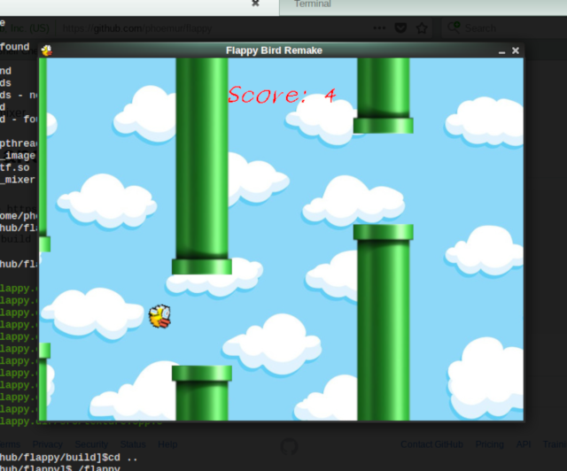

# flappy
Flappy Bird Clone made with C++14 and SDL2

# Requirements
  - C++14
  
  - SDL2
  
  - SDL2_image
  
  - SDL2_ttf
  
  - SDL2_mixer
  
# Build and Run
    git clone https://github.com/phoemur/flappy.git
    cd flappy
    mkdir -p build
    cd build
    cmake ..
    make
    cd ..
    ./flappy
    
# Run Online
[Emscripten Build](https://phoemur.github.io/flappy/flappy.html)

# Screenshot

